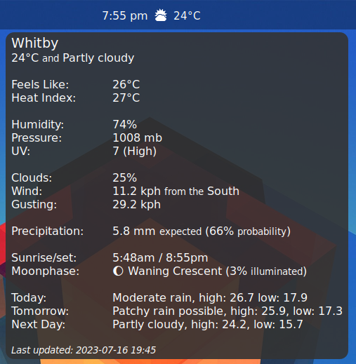

# weatherAPI

This is a genmon bash script to query and display weather data using the weatherAPI (https://rapidapi.com/weatherapi/api/weatherapi-com/).

**Requires:** xfce4-genmon-plugin wget jq APIKEY (from https://rapidapi.com/weatherapi/api/weatherapi-com/)

Note: depending on the font your are using, you may need to adjust the number of "\t" (tabs) in the tooltip string to get the readings to line up properly.

**How To:**

  1. Clone this repository to your local machine
  2. edit the weatherAPI.sh script file and make any necessarry changes to the "configurable items" section:
       - USE_SITEID = whether to use the SITE name you pass in to this command (1) or the one returned by the API (0)
       - SITE = if USE_SITEID=1, then set the site (City/Town/etc) name here
       - UNIT = 'metric' or 'imperial'
       - KEY = your personal weatherAPI key from https://rapidapi.com/weatherapi/api/weatherapi-com/ (or place key in $HOME/.weatherAPI_key)
       - QLOOKUP = method used to lookup weather (see request parameter 'q' at https://www.weatherapi.com/docs/)
       - WEATHER_LINK = the URL of webpage to open when plugin is clicked
  3. Add the genmon plugin to the panel
  4. Set in it's properties:
     - if specifying exact latitude/longitude coordinates:
        - command = /path/to/weatherAPI.sh
  5. Uncheck label
  6. Period = 900 (or whatever refresh value you want - weatherAPI allows 1 million refreshes per month with free subscription_
  7. click on Save

**Screenshot:**

